# Create berhasil di Postman
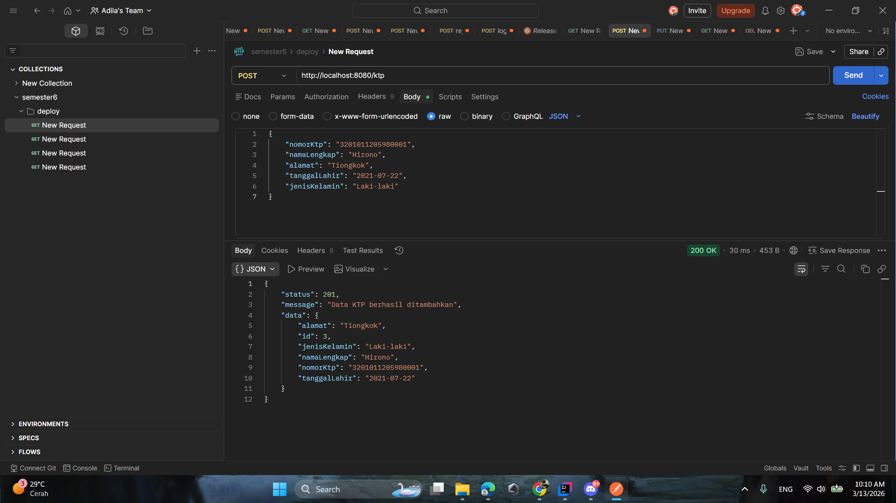

# Create gagal di Postman
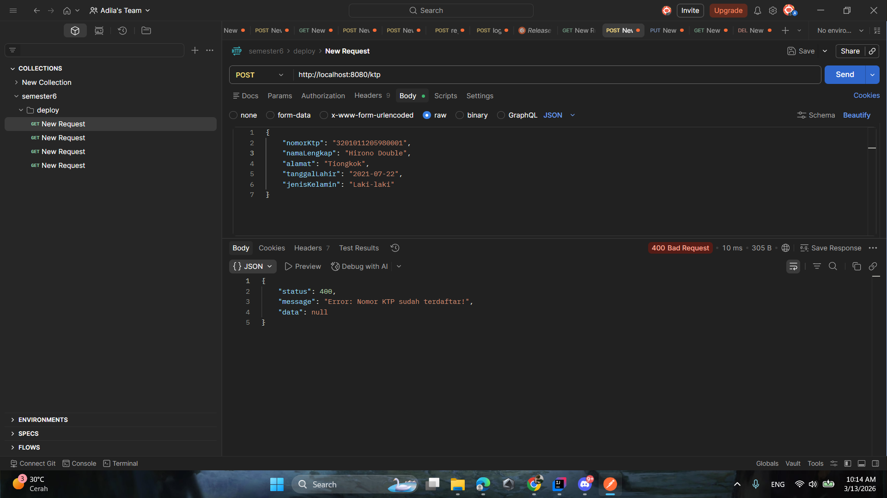

# Update di Postman
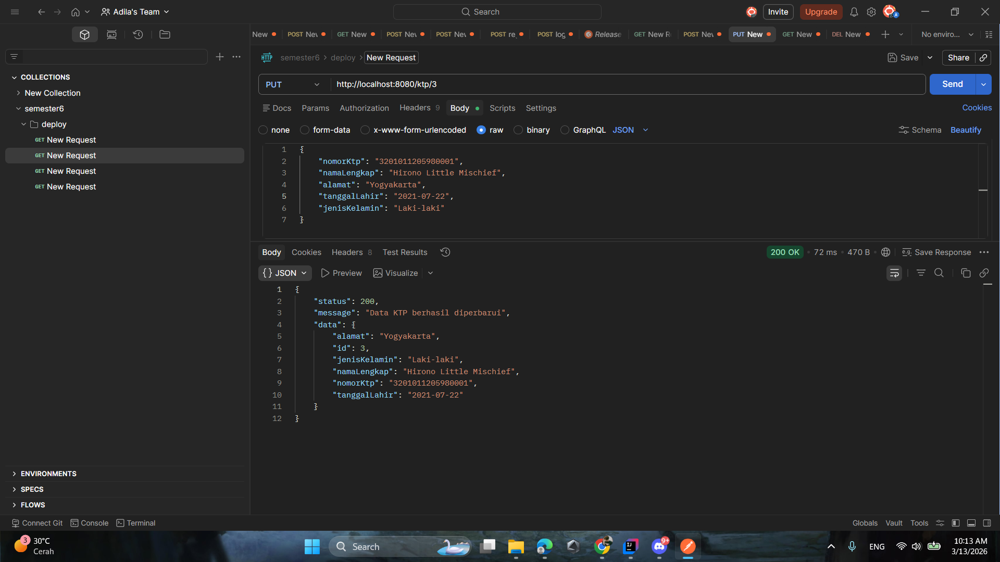

# Read di Postman
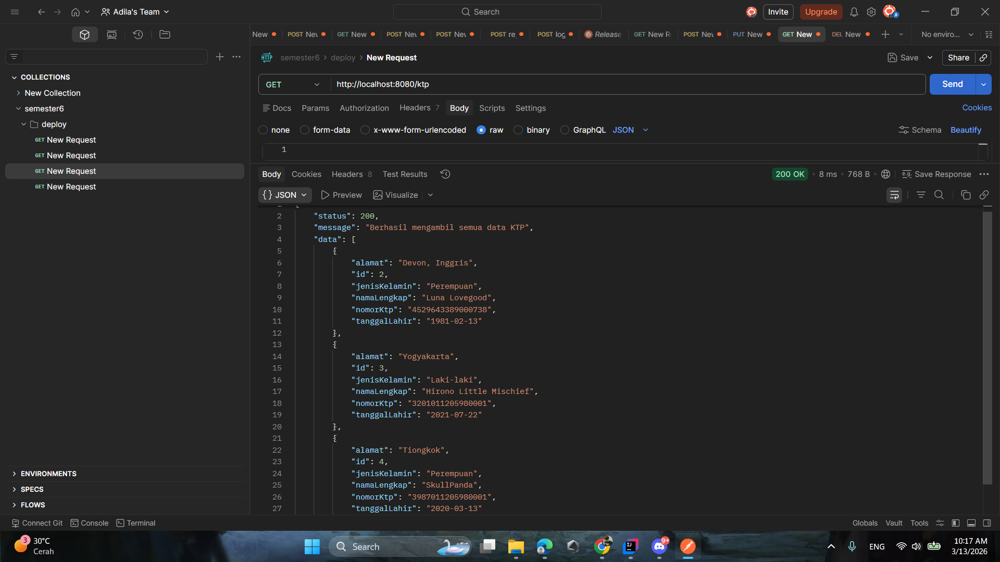

# Delete di Postman
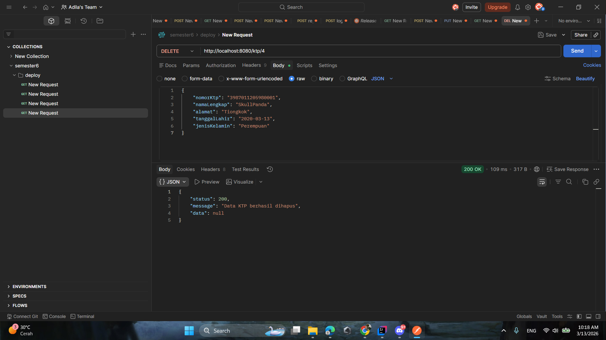

# Create berhasil di Tampilan
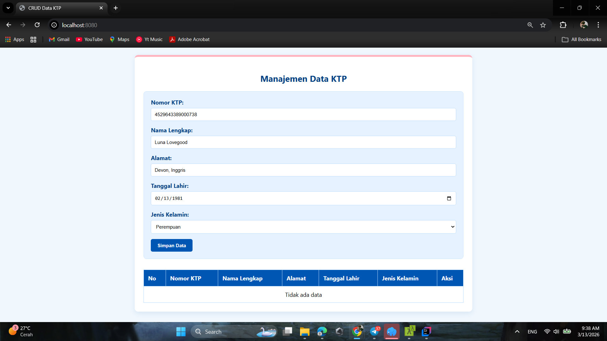
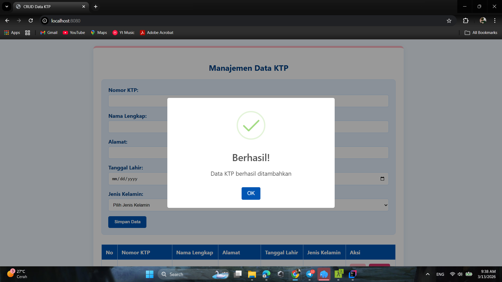

# Create gagal di Tampilan
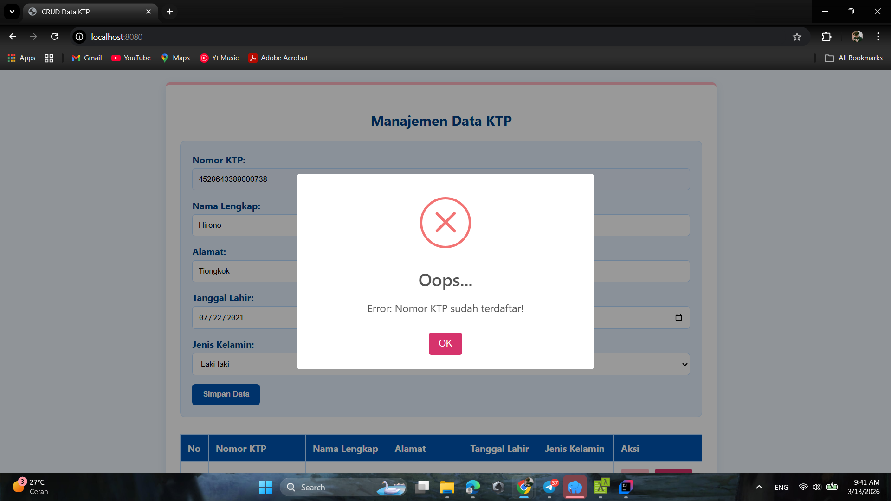

# Read di Tampilan
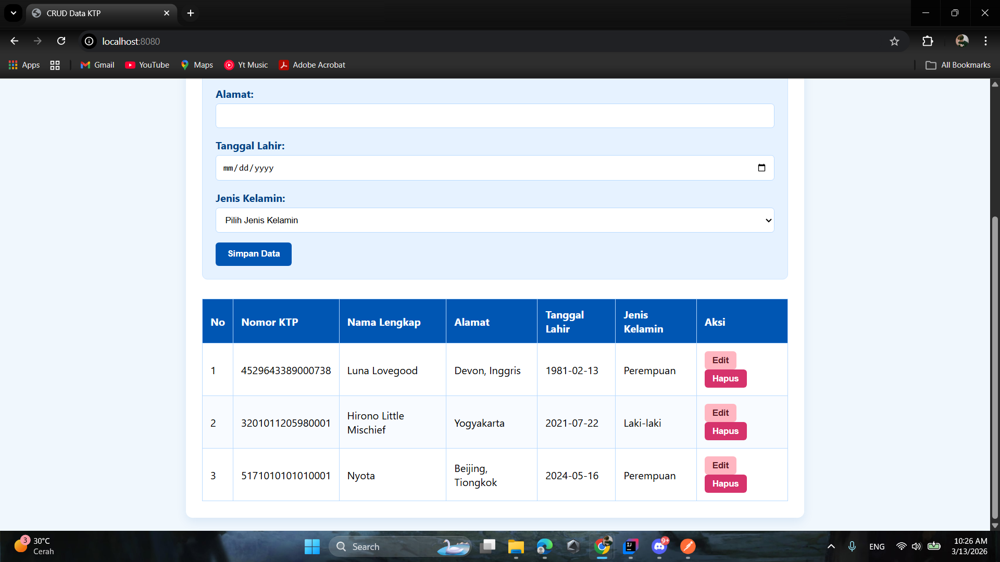

# Update di Tampilan
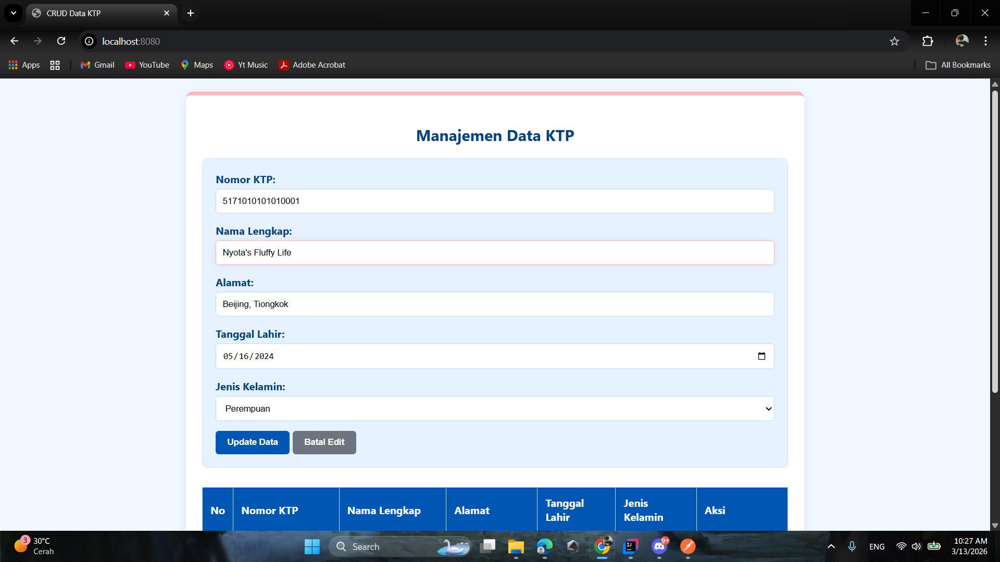

# Delete di Tampilan
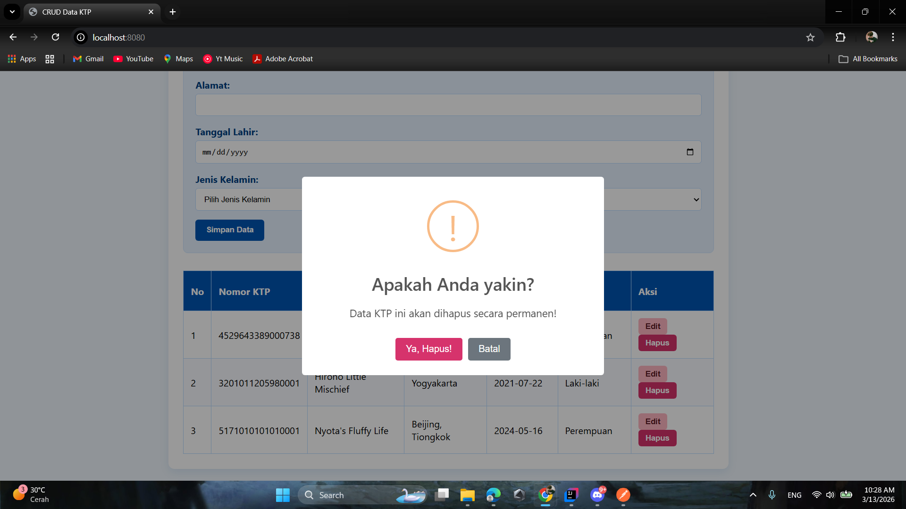
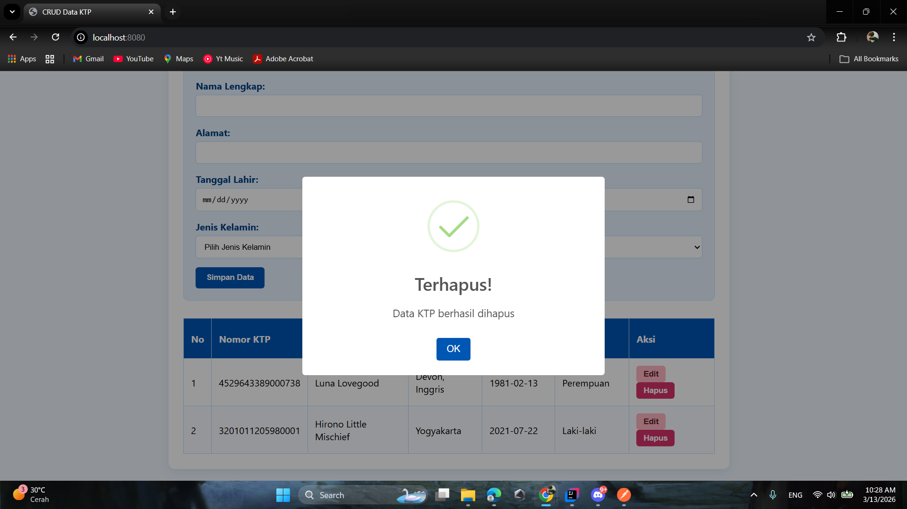